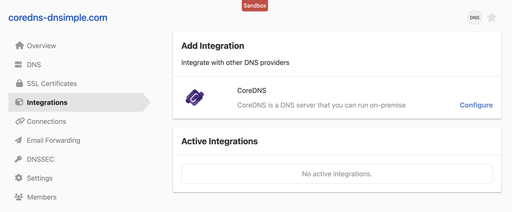
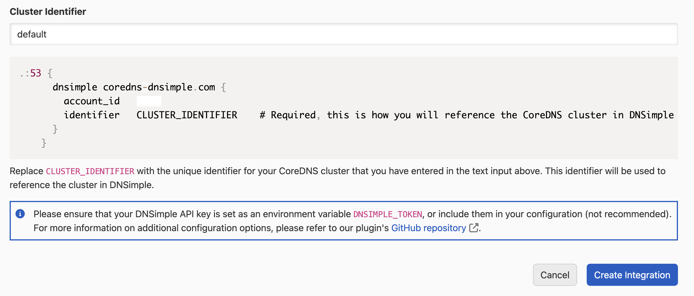
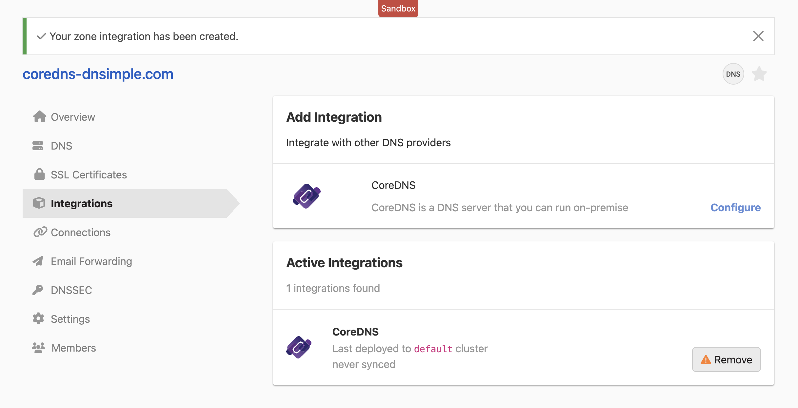

# Deploy on-premise DNS using CoreDNS and DNSimple

DNSimple's CoreDNS plugin enables businesses and individual developers alike to leverage the extensibility of CoreDNS, while effortlessly managing DNS records through DNSimple's intuitive web application. Facilitate streamlined DNS record management, and ensure your on-premise DNS resolution is tightly aligned with any changes or updates made within the DNSimple platform. Whether managing one domain or multiple domains with many DNS records, DNSimple's CoreDNS integration offers increased reliability, ease of management, and enterprise-level stability.

## Introduction

In this demo, we will use CoreDNS compiled with the [DNSimple CoreDNS plugin](https://github.com/dnsimple/coredns-dnsimple/) to deploy an on-premise CoreDNS instance supporting synchronized DNS record management from within the DNSimple platform.

## Prerequisites

- A machine where you can install and run CoreDNS (local workstation, physical server, or virtual machine)
- A domain managed with DNSimple
- An API token from DNSimple, which will allow CoreDNS to access DNSimple’s services
- Basic knowledge of DNS and terminal/command line usage
- Go installed (if you're going to build CoreDNS from source)

### Step 1: Enable the DNSimple CoreDNS Integration

1. From the DNSimple application, navigate to the 'Domain->Integrations' page, and select 'Configure' next to the CoreDNS integration.


2. Leave the Cluster Identifier value as `default`, and note down your DNSimple `account_id` from the provided Corefile.


3. Click 'Create Integration', and verify the CoreDNS integration is active.


### Step 2: Compile or Install CoreDNS

<details>
<summary>A: Compile from Source</summary>
<br>

1. Clone the CoreDNS source code from its official GitHub repository:

```shell
git clone https://github.com/coredns/coredns.git
```

2. Navigate to the CoreDNS directory:

```shell
cd coredns
```

3. Modify the `plugin.cfg` file to include the DNSimple plugin by adding the import statement after route53.

```txt
route53:route53
dnsimple:github.com/dnsimple/coredns-dnsimple
...
```

4. Get the CoreDNS DNSimple Plugin:

```shell
go get github.com/dnsimple/coredns-dnsimple
```

5. Build CoreDNS with the DNSimple Plugin:

```shell
go generate && go build
```

6. Verify and move the binary to a location in your PATH.

</details>

<details>
<summary>B: Download the Precompiled Binary</summary>
<br>

1. Go to the [DNSimple CoreDNS releases page](https://github.com/dnsimple/coredns-dnsimple/releases).
2. Download the latest release for your OS.
3. Extract and move the binary to a location in your PATH.

</details>

### Step 3: Export your DNSimple Credentials

```shell
export DNSIMPLE_ACCOUNT_ID=1234
export DNSIMPLE_TOKEN=dnsimple-api-token
```

Replace `DNSIMPLE_ACCOUNT_ID` and `DNSIMPLE_TOKEN` values with your actual DNSimple account ID and API token.

### Step 4: Create a Corefile and Run CoreDNS

1. Create a `Corefile` or copy the example provided with this repository:

```txt
.:53 {
    dnsimple DNSIMPLE_MANAGED_DOMAIN.TLD {
        identifier "default"
        refresh    60s
    }
    forward . 1.1.1.1
    cache
    log
    errors
}
```

Replace `DNSIMPLE_MANAGED_DOMAIN.TLD` with your actual domain managed at DNSimple. This configuration will use DNSimple for domain information and forward other queries to Cloudflare’s Public DNS server (1.1.1.1).

2. With the `Corefile` created, start CoreDNS pointing to your `Corefile`:

```shell
coredns -conf ./Corefile
```

### Step 5: Test DNS Resolution

From another machine, or the same machine, query the DNS server to ensure that it is resolving domains correctly.

```shell
dig @{DNS_SERVER_ADDRESS} {DNSIMPLE_MANAGED_DOMAIN.TLD} NS
```

### Conclusion:

You should now have a basic on-premise DNS server setup using CoreDNS and DNSimple. Make sure to adjust firewall rules, routing, and security settings according to your network setup and security policy to ensure the DNS server operates reliably and securely.
